# fastAPIWebApp

[](https://github.com/skondla/flaskAPIWebApp/blob/main/LICENSE)
[](https://join.slack.com/t/devops-zwf1016/shared_invite/zt-1wsafgivm-iI88~ZqZBaKGzYhD8N2JsA)
[](https://github.com/skondla/flaskAPIWebApp/actions)
[](https://github.com/skondla/flaskAPIWebApp/actions)
[](https://github.com/skondla/flaskAPIWebApp/actions)
[](https://github.com/skondla/flaskAPIWebApp/actions)
[](https://twitter.com/skondla)

A multi-cloud, containerized web application and REST API for managing AWS RDS database operations — including restore from snapshot, status monitoring, and cluster attachment. Deployed on Kubernetes (EKS, GKE) with a full DevSecOps pipeline via GitHub Actions and ArgoCD GitOps.

> **Flask → FastAPI Migration** — Both the USER and ADMIN applications have been fully converted from Flask to FastAPI (Python 3.11, Uvicorn, JWT OAuth 2.0, Pydantic v2, OWASP Top 10 middleware). The FastAPI versions live in `dockerized/USER_FASTAPI/` and `dockerized/ADMIN_FASTAPI/`. The original Flask source files in `dockerized/USER/` and `dockerized/ADMIN/` are retained as legacy reference.

> **Agentic AI Orchestration** — USER_FASTAPI includes a [LangGraph](https://langchain-ai.github.io/langgraph/)-powered ReAct agent (`lib/agent_orchestrator.py`) that plans and executes the restore → status-check → optional-attach → notify workflow as a single operation, via `GET/POST /agent/restore-workflow`. See [Agentic Restore Workflow](#agentic-restore-workflow--langgraph-orchestration) below.

> **Gap Closure & AI-Native DevSecOps** — Every gap category from the external expert analysis (enforcement, supply chain, secrets & identity, runtime policy, delivery discipline, observability & SRE, governance, modernization) has been addressed. Highlights: RS256 JWT with refresh rotation + server-side revocation, SLSA provenance + Kyverno admission verification of signed/attested images, DAST on pull requests, committed SLOs/alerts/dashboards with OpenTelemetry, full governance paperwork (SECURITY.md, ADRs, CODEOWNERS, IR/DR/retention policies), and an AI layer — SARIF triage agent, AI code review, AI runbook generator, and an MCP server ([`ai/`](ai/), [`.mcp.json`](.mcp.json)). The finding-by-finding map is in [docs/gap-closure.md](docs/gap-closure.md).

---

## Table of Contents

- [Overview](#overview)
- [Architecture](#architecture)
  - [High-Level System Architecture](#high-level-system-architecture)
  - [Application Component Architecture](#application-component-architecture)
  - [Deployment Topology — Multi-Cloud Kubernetes](#deployment-topology--multi-cloud-kubernetes)
- [Technology Stack](#technology-stack)
- [Application Structure](#application-structure)
- [API Endpoints](#api-endpoints)
- [Database Schema](#database-schema)
- [Data Flow Diagrams](#data-flow-diagrams)
  - [Authentication & JWT Issuance](#authentication--jwt-issuance)
  - [RDS Restore Operation — End-to-End](#rds-restore-operation--end-to-end)
  - [Agentic Restore Workflow — LangGraph Orchestration](#agentic-restore-workflow--langgraph-orchestration)
  - [Request Pipeline & OWASP Middleware Chain](#request-pipeline--owasp-middleware-chain)
- [Network Architecture](#network-architecture)
  - [AWS VPC & EKS Network Topology](#aws-vpc--eks-network-topology)
  - [Kubernetes Service Mesh & Pod Networking](#kubernetes-service-mesh--pod-networking)
  - [Ingress & TLS Termination Flow](#ingress--tls-termination-flow)
- [Infrastructure](#infrastructure)
- [CI/CD Pipeline](#cicd-pipeline)
  - [DevSecOps Pipeline — 9-Stage Flow](#devsecops-pipeline--9-stage-flow)
  - [Pipeline Stage Dependency Graph](#pipeline-stage-dependency-graph)
  - [GitOps Reconciliation Loop (ArgoCD)](#gitops-reconciliation-loop-argocd)
  - [Security Scanning Coverage Matrix](#security-scanning-coverage-matrix)
- [Getting Started](#getting-started)
- [Usage — cURL Examples](#usage--curl-examples)
- [Screenshots](#screenshots)
- [Contact](#contact)

---

## Overview

The application exposes both a web interface (HTML/Jinja2) and a REST API for the following AWS RDS operations:

1. **Restore** — Restore an AWS RDS instance or Aurora cluster from a snapshot.
2. **Status** — Check the restore progress of a database instance or cluster.
3. **Attach DB** — Attach a new instance to an existing Aurora DB cluster.
4. **Agent Workflow** — A LangGraph ReAct agent (Claude) plans and executes restore → status → attach → notify as one orchestrated operation instead of three manual steps.
5. **Authentication** — JWT-based login/signup with bcrypt password hashing.
6. **Audit Logging** — Every user action is recorded (email, IP, timestamp, endpoint, request type), including each tool call the agent makes.

Authentication is required for all database operations. User signup is restricted to Admin console users only.

---

## Architecture

### High-Level System Architecture

A bird's-eye view of the full system — clients, the two FastAPI services, persistence, AWS managed services, the CI/CD plane, and the GitOps controller.

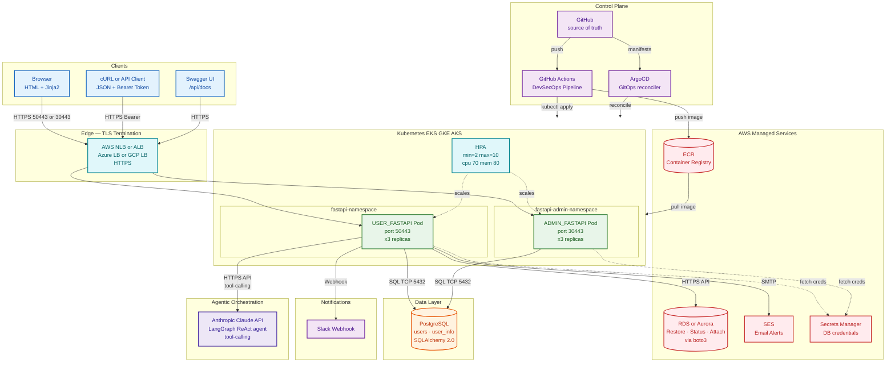

### Application Component Architecture

Internal layering of each FastAPI service — middleware chain, routers, dependencies, and persistence.

```mermaid
flowchart LR
    classDef mw fill:#FFF8E1,stroke:#F57F17,stroke-width:2px,color:#E65100
    classDef route fill:#E8EAF6,stroke:#283593,stroke-width:2px,color:#1A237E
    classDef sec fill:#FCE4EC,stroke:#AD1457,stroke-width:2px,color:#880E4F
    classDef model fill:#E0F2F1,stroke:#00695C,stroke-width:2px,color:#004D40

    REQ([HTTP Request]) --> MW1
    subgraph MWChain["Middleware Chain — LIFO order"]
        direction LR
        MW1["CORS<br/>Middleware"]
        MW2["RateLimit<br/>200/min · 10/min auth"]
        MW3["SecurityHeaders<br/>HSTS · CSP · X-Frame"]
        MW4["SecurityAudit<br/>structured log"]
        MW1 --> MW2 --> MW3 --> MW4
    end

    MW4 --> ROUTER

    subgraph ROUTER["FastAPI Router Dispatch"]
        direction TB
        AUTH["auth.py<br/>/login · /signup · /logout<br/>/auth/token · /auth/refresh<br/>/auth/me · /auth/register"]
        MAIN["main_router.py<br/>/ · /restore · /status<br/>/attachdb · /profile<br/>/agent/restore-workflow"]
    end

    AUTH --> SEC
    MAIN --> SEC

    MAIN -->|"RestoreOrchestrator.run"| AGENT["agent_orchestrator.py<br/>LangGraph create_react_agent<br/>tools: restore · status · attach · notify"]

    subgraph SEC["Security Layer · security.py"]
        direction TB
        JWT["JWT OAuth 2.0<br/>HS256 · 30 min access<br/>7 day refresh"]
        BCRYPT["bcrypt + passlib<br/>+ werkzeug fallback"]
        DEPS["FastAPI Depends<br/>get_current_user<br/>get_optional_user"]
        SSRF["SSRF Guard<br/>validate_rds_endpoint"]
    end

    SEC --> DAL

    subgraph DAL["Data Access Layer"]
        direction TB
        SQLA["SQLAlchemy 2.0<br/>Session per request"]
        MODELS["models.py<br/>User · Userinfo"]
        SCHEMAS["schemas.py<br/>Pydantic v2 DTOs"]
        SQLA --> MODELS
        SQLA --> SCHEMAS
    end

    DAL --> PG[("PostgreSQL")]

    MAIN -->|"boto3"| AWS_RDS[("AWS RDS or Aurora")]
    MAIN -->|"requests"| SLACK([Slack])
    MAIN -->|"mailx"| SES([AWS SES])
    AGENT -->|"rds_ops.py<br/>boto3 · requests · mailx"| AWS_RDS
    AGENT -->|"HTTPS API"| CLAUDE([Anthropic Claude API])

    class MW1,MW2,MW3,MW4 mw
    class AUTH,MAIN route
    class JWT,BCRYPT,DEPS,SSRF sec
    class SQLA,MODELS,SCHEMAS model
    class AGENT,CLAUDE sec
```

### Deployment Topology — Multi-Cloud Kubernetes

The same container image deploys to AWS EKS, GCP GKE, and Azure AKS via cloud-specific Terraform + manifests.

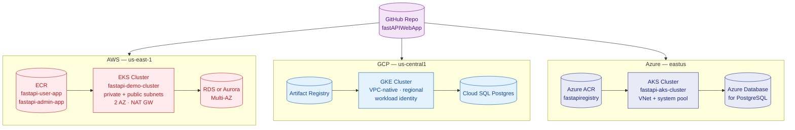

---

## Technology Stack

### FastAPI Applications (current)

| Layer | ADMIN_FASTAPI | USER_FASTAPI |
|---|---|---|
| Language | Python 3.11 | Python 3.11 |
| Web Framework | **FastAPI** | **FastAPI** |
| ASGI Server | **Uvicorn** | **Uvicorn** |
| Templating | Jinja2 | Jinja2 |
| Authentication | **JWT OAuth 2.0** (python-jose) | **JWT OAuth 2.0** (python-jose) |
| Password Hashing | bcrypt (passlib) + werkzeug fallback | bcrypt (passlib) + werkzeug fallback |
| Schema Validation | **Pydantic v2** | **Pydantic v2** |
| ORM | SQLAlchemy 2.0 | SQLAlchemy 2.0 |
| Database | PostgreSQL (psycopg2) | PostgreSQL (psycopg2) |
| Security | OWASP Top 10 middleware, rate-limiting, security headers | OWASP Top 10 middleware, rate-limiting, security headers |
| AWS SDK | boto3 / botocore | boto3 / botocore |
| HTTP Client | requests | requests |
| Agentic Orchestration | — | **LangGraph** ReAct agent + **LangChain** tools over **Claude** (Anthropic) |
| Testing | pytest + httpx | pytest + httpx |
| Port | 30443 (HTTPS) | 50443 (HTTPS) |

### Flask Applications (legacy reference)

| Layer | ADMIN (Flask) | USER (Flask) |
|---|---|---|
| Language | Python 3.9 | Python 3.9 |
| Web Framework | Flask | Flask |
| WSGI Server | mod_wsgi (httpd) | mod_wsgi |
| Authentication | Flask-Login | Flask-Login |
| Password Hashing | werkzeug pbkdf2:sha256 | werkzeug pbkdf2:sha256 |
| ORM | Flask-SQLAlchemy | Flask-SQLAlchemy |

### Infrastructure

| Infrastructure | Technology |
|---|---|
| Containerization | Docker (Python 3.11-slim) |
| Orchestration | Kubernetes (EKS, GKE, AKS) |
| Manifest templating | Kustomize (per app × cloud base, `images:` transform for the deploy-time tag) |
| IaC | Terraform (modular, AWS) |
| CI/CD | GitHub Actions — 10-stage pipeline, all scan gates blocking |
| GitOps | **ArgoCD** — sole applier of cluster state (CI calls the ArgoCD API only) |
| Supply-chain integrity | cosign (keyless image signing) + syft SBOM (SPDX) + attestation |
| Secrets | Secrets Store CSI Driver → AWS Secrets Manager / Azure Key Vault / GCP Secret Manager |
| Network security | Kubernetes NetworkPolicy (ingress/egress baseline, all 6 app × cloud combos) |
| Security Scanning | Trivy (CRITICAL/HIGH, blocking), Checkov (blocking) |
| Observability | Prometheus + Grafana (K8s operators) |
| Message Queue | RabbitMQ (K8s operator) |
| Cloud Providers | AWS (primary), GCP, Azure |
| TLS | Self-signed certs (containers) / ACM (AWS ALB) |

---

## Application Structure

```
fastAPIWebApp/
├── dockerized/
│   ├── ADMIN_FASTAPI/            # ✅ FastAPI Admin Portal (converted from ADMIN/)
│   │   ├── main.py               # FastAPI app: middleware, router includes, exception handler
│   │   ├── database.py           # SQLAlchemy 2.0 engine + session factory
│   │   ├── models.py             # ORM: User, Users (SQLAlchemy DeclarativeBase)
│   │   ├── schemas.py            # Pydantic v2: UserCreate, UserResponse, Token
│   │   ├── security.py           # JWT OAuth 2.0: create/decode tokens, bcrypt, dependencies
│   │   ├── security_middleware.py# OWASP Top 10: security headers, rate-limit, audit log
│   │   ├── routers/
│   │   │   ├── auth.py           # /login /signup /logout + /auth/token /auth/me /auth/register
│   │   │   └── main_router.py    # / (index), /profile (protected)
│   │   ├── templates/            # Jinja2 HTML: base, index, login, signup, profile
│   │   ├── Dockerfile            # Python 3.11-slim, Uvicorn, self-signed TLS, port 30443
│   │   ├── startup.sh            # Container entrypoint: sets env vars, starts Uvicorn
│   │   └── requirements.txt      # fastapi, uvicorn, sqlalchemy, passlib, python-jose, ...
│   │
│   ├── USER_FASTAPI/             # ✅ FastAPI User App (converted from USER/)
│   │   ├── main.py               # FastAPI app: middleware, exception handler
│   │   ├── database.py           # SQLAlchemy 2.0 engine + session factory
│   │   ├── models.py             # ORM: User, Userinfo
│   │   ├── schemas.py            # Pydantic v2: UserCreate, Token, RestoreRequest, ...
│   │   ├── security.py           # JWT OAuth 2.0 + werkzeug pbkdf2 migration support
│   │   ├── security_middleware.py# OWASP Top 10 middleware + SSRF endpoint validation
│   │   ├── routers/
│   │   │   ├── auth.py           # /login /signup /logout + OAuth2 API endpoints
│   │   │   └── main_router.py    # / /restore /status /attachdb /agent/restore-workflow
│   │   ├── lib/
│   │   │   ├── rdsAdmin.py       # RDS: RDSDescribe, RDSCreate, RDSRestore, RDSDelete
│   │   │   ├── rds_ops.py        # Shared restore/status/attach/notify wrappers
│   │   │   ├── agent_orchestrator.py # LangGraph ReAct agent — plans/executes the restore workflow
│   │   │   └── utils.py          # AWS Secrets Manager helper
│   │   ├── templates/            # Jinja2 HTML: base, login, signup, restore, status, attachdb, agent_workflow
│   │   ├── docs/                 # API docs (api.md, architecture.drawio)
│   │   ├── Dockerfile            # Python 3.11-slim, Uvicorn, self-signed TLS, port 50443
│   │   ├── startup.sh            # Container entrypoint
│   │   └── requirements.txt      # fastapi, uvicorn, sqlalchemy, passlib, boto3, ...
│   │
│   ├── ADMIN/                    # ⚠️  Flask Admin (legacy — see ADMIN_FASTAPI/ for FastAPI)
│   │   ├── main.py               # Flask Blueprint: / /profile
│   │   ├── auth.py               # Flask Blueprint: /login /signup /logout
│   │   ├── models.py             # Flask-SQLAlchemy: User, Users
│   │   ├── lib/
│   │   │   ├── rdsAdmin.py       # RDS operations
│   │   │   └── sesAdmin.py       # SES email
│   │   ├── templates/            # Jinja2 HTML (Flask url_for — not compatible with FastAPI)
│   │   ├── Dockerfile            # Python 3.9.13, mod_wsgi, port 30443
│   │   └── requirements.txt      # flask, flask-login, flask-sqlalchemy, ...
│   │
│   ├── USER/                     # ⚠️  Flask User App (legacy — see USER_FASTAPI/ for FastAPI)
│   │   ├── main.py               # Flask Blueprint: / /restore /status /attachdb
│   │   ├── auth.py               # Flask Blueprint: auth + RDS operations
│   │   ├── models.py             # Flask-SQLAlchemy: User, Userinfo
│   │   ├── lib/
│   │   │   ├── rdsAdmin.py       # RDS classes
│   │   │   └── sesAdmin.py       # SES email
│   │   ├── templates/            # Jinja2 HTML (Flask url_for)
│   │   ├── Dockerfile            # Python 3.9.13, port 50443
│   │   └── requirements.txt      # flask, flask-login, flask-sqlalchemy, ...
│   │
│   └── DB/
│       └── schema/
│           └── flaskapp.sql      # PostgreSQL schema: users + user_info tables
│
├── provisioning/
│   └── terraform/aws/web_infra/  # Modular Terraform for AWS
│       ├── main.tf               # Root module, provider config
│       ├── variables.tf          # Input variables
│       ├── outputs.tf            # Output values
│       └── modules/
│           ├── vpc/              # VPC + public/private subnets (us-west-2)
│           ├── nat_gateway/      # NAT gateway for private subnet egress
│           ├── security_groups/  # Inbound/outbound rules
│           ├── alb/              # Application Load Balancer
│           ├── ec2/app/          # App server EC2 instances
│           ├── ec2/bastion/      # Bastion host for SSH access
│           ├── route_tables/     # Route table associations
│           ├── subnets/          # Subnet definitions
│           ├── acm/              # AWS Certificate Manager (TLS)
│           └── vpc-endpoint-s3/  # S3 VPC endpoint (private subnet)
│
├── aws/
│   ├── ecr/                      # ECR repo setup/destroy scripts
│   ├── ecs/                      # ECS task definitions + IAM policies
│   ├── eks/                      # EKS cluster scripts + K8s manifests
│   └── web_infra/                # Additional AWS web infra scripts
│
├── gcp/
│   └── gke/deploy/manifests/flaskapp1/
│       ├── Deployment_admin_ui.yaml   # 3-replica admin deployment
│       ├── Deployment_user_ui.yaml    # User app deployment
│       ├── Service_admin_ui.yaml      # K8s service for admin
│       └── Service_user_ui.yaml       # K8s service for user
│
├── kubernetes/
│   └── operators/                # Grafana, Prometheus, RabbitMQ operators
│
├── argocd/                       # Real ArgoCD (sole applier) — install script + Application CRs
│   ├── helm/argocd.sh            # Installs argo/argo-cd (previously mislabeled: installed Argo Workflows)
│   └── apps/                     # 6 Application CRs — one per app x cloud, syncPolicy.automated
│
├── actions/
│   ├── Deploy-GKE.yml            # GKE DevSecOps pipeline (test → build → deploy)
│   ├── google.yml                # GCP-specific workflow
│   └── trivy-scan.yaml           # Trivy CRITICAL vulnerability scanning → SARIF
│
└── images/                       # Documentation screenshots
```

---

## API Endpoints

### USER_FASTAPI (port `50443`)

#### Web UI (HTML, cookie-based JWT)

| Method | Endpoint | Auth Required | Description |
|---|---|---|---|
| `GET` | `/` | No | Landing page |
| `GET` | `/login` | No | Login form |
| `POST` | `/login` | No | Authenticate; sets JWT HttpOnly cookie |
| `GET` | `/signup` | No | Signup form |
| `POST` | `/signup` | No | Create account (bcrypt-hashed password) |
| `GET` | `/logout` | No | Clear auth cookies, redirect to `/login` |
| `GET` | `/restore` | Yes | Restore DB form |
| `POST` | `/restore` | Yes | Restore RDS instance or Aurora cluster from snapshot |
| `GET` | `/status` | Yes | Status check form |
| `POST` | `/status` | Yes | Poll RDS restore / instance status |
| `GET` | `/attachdb` | Yes | Attach DB form |
| `POST` | `/attachdb` | Yes | Create and attach instance to Aurora cluster |
| `GET` | `/agent/restore-workflow` | Yes | Agent workflow form (snapshot, source endpoint, optional target instance class + goal) |
| `POST` | `/agent/restore-workflow` | Yes | LangGraph agent plans/executes restore → status → optional attach → notify in one call |

#### OAuth2 / REST API (JSON, Bearer token)

| Method | Endpoint | Auth Required | Description |
|---|---|---|---|
| `POST` | `/auth/token` | No | OAuth2 password flow — returns access + refresh tokens |
| `POST` | `/auth/refresh` | No (refresh cookie) | Exchange refresh token for new access token |
| `GET` | `/auth/me` | Yes | Return current user profile |
| `POST` | `/auth/register` | No | Register new user (API, returns JSON) |
| `GET` | `/api/docs` | No | Swagger UI |
| `GET` | `/api/redoc` | No | ReDoc |

### ADMIN_FASTAPI (port `30443`)

#### Web UI (HTML, cookie-based JWT)

| Method | Endpoint | Auth Required | Description |
|---|---|---|---|
| `GET` | `/` | No | Admin portal landing page |
| `GET` | `/login` | No | Admin login form |
| `POST` | `/login` | No | Authenticate; sets JWT HttpOnly cookie |
| `GET` | `/signup` | No | Admin signup form |
| `POST` | `/signup` | No | Create admin account |
| `GET` | `/logout` | No | Clear auth cookies |
| `GET` | `/profile` | Yes | Authenticated admin profile page |

#### OAuth2 / REST API (JSON, Bearer token)

| Method | Endpoint | Auth Required | Description |
|---|---|---|---|
| `POST` | `/auth/token` | No | OAuth2 password flow |
| `POST` | `/auth/refresh` | No (refresh cookie) | Refresh access token |
| `GET` | `/auth/me` | Yes | Return current admin profile |
| `POST` | `/auth/register` | No | Register admin user (API, returns JSON) |
| `GET` | `/api/docs` | No | Swagger UI |
| `GET` | `/api/redoc` | No | ReDoc |

---

## Database Schema

PostgreSQL, managed via SQLAlchemy ORM. The `flaskapp.sql` bootstrap file creates:

```sql
-- Registered users
CREATE TABLE users (
    id       SERIAL PRIMARY KEY,
    email    VARCHAR(100) UNIQUE NOT NULL,
    password VARCHAR(1000) NOT NULL,   -- bcrypt hash
    name     VARCHAR(1000) NOT NULL
);

-- Audit / activity log
CREATE TABLE user_info (
    id          SERIAL PRIMARY KEY,
    email       VARCHAR(100) NOT NULL,
    ip          VARCHAR(50)  NOT NULL,  -- real IP via X-Forwarded-For
    time        VARCHAR(60)  NOT NULL,  -- YYYYMMDDHHmm
    requesttype VARCHAR(30),            -- GET / POST
    endpoint    VARCHAR(100),           -- e.g. /restore
    comments    VARCHAR(200)
);
```

---

## Data Flow Diagrams

### Authentication & JWT Issuance

OAuth 2.0 password-flow with bcrypt verification and HttpOnly cookie + Bearer header dual-mode auth. See [`security.py`](dockerized/USER_FASTAPI/security.py) and [`routers/auth.py`](dockerized/USER_FASTAPI/routers/auth.py).

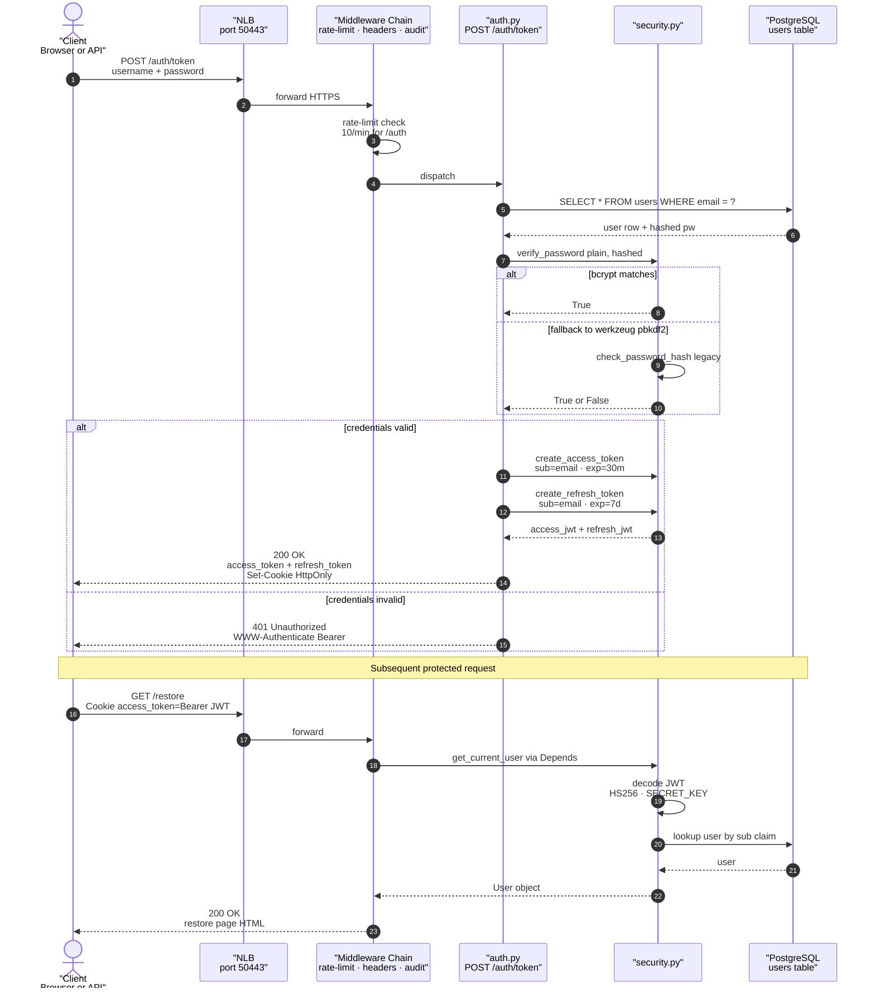

### RDS Restore Operation — End-to-End

Full data flow for `POST /restore` — from form submission through AWS RDS API call to multi-channel notification and audit logging.

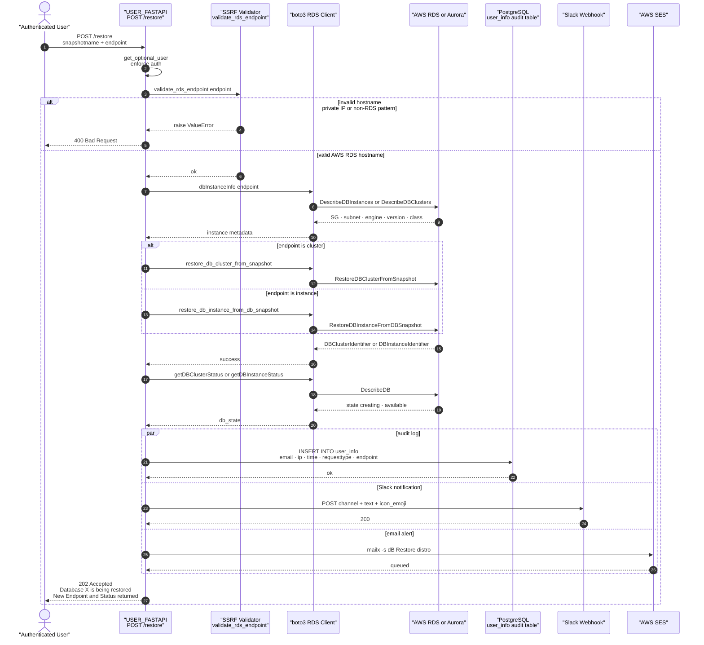

### Agentic Restore Workflow — LangGraph Orchestration

`POST /agent/restore-workflow` replaces three manual form submissions (restore, status, attach) with a single call. A LangGraph `create_react_agent` ReAct loop plans and executes the minimum necessary tool calls — capped at 8 tool calls and 30s of total poll-wait so it stays inside one HTTP request. See [`lib/agent_orchestrator.py`](dockerized/USER_FASTAPI/lib/agent_orchestrator.py).

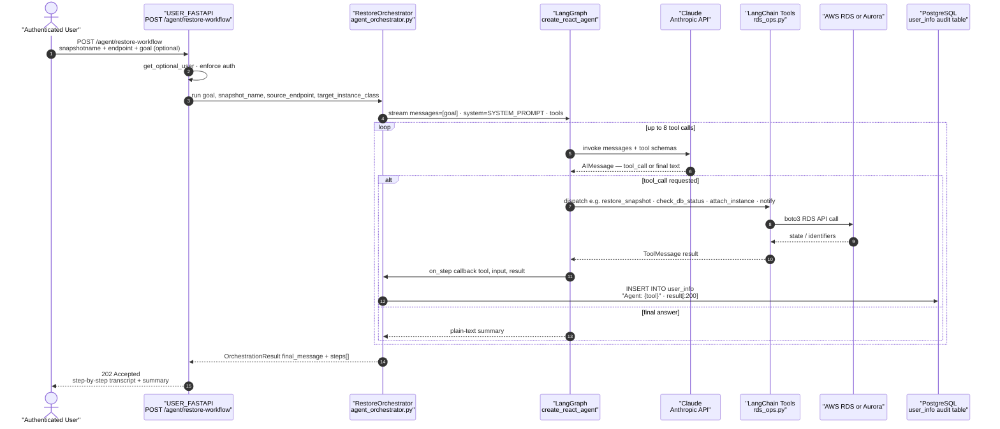

### Request Pipeline & OWASP Middleware Chain

Every request traverses four middleware layers before reaching a route handler. Order is LIFO — last added runs first.

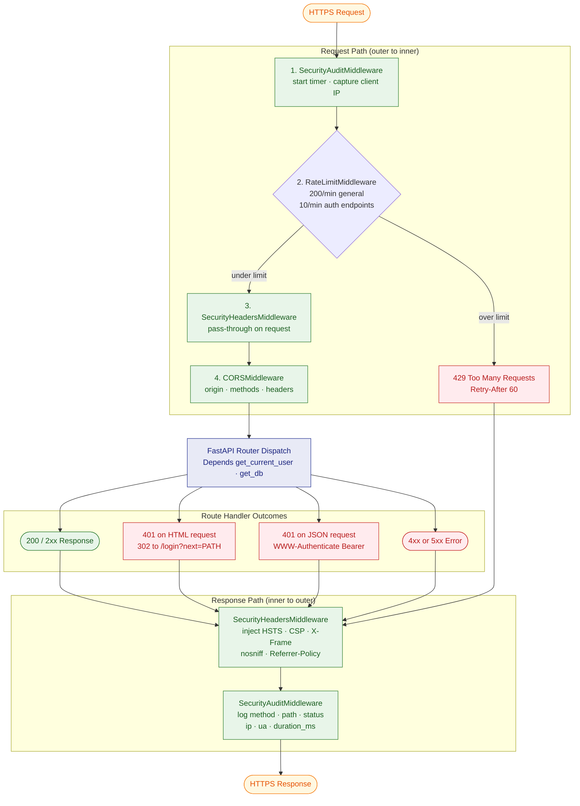

---

## Network Architecture

### AWS VPC & EKS Network Topology

Defined in [`aws/eks/deploy/terraform/`](aws/eks/deploy/terraform/) — `192.168.0.0/16` VPC across two AZs with public/private subnet pairs.

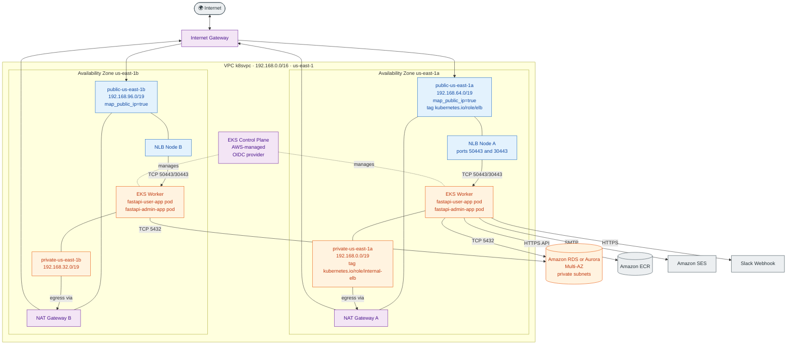

### Kubernetes Service Mesh & Pod Networking

Per-namespace topology with HPA, NLB, init container DB wait, and pod-level security context. From [`aws/eks/deploy/manifest/fastapi1/`](aws/eks/deploy/manifest/fastapi1/).

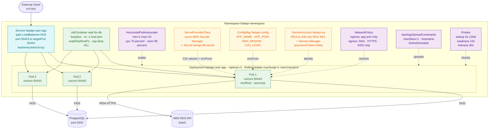

### Ingress & TLS Termination Flow

End-to-end TLS path showing where each hop terminates / re-encrypts.

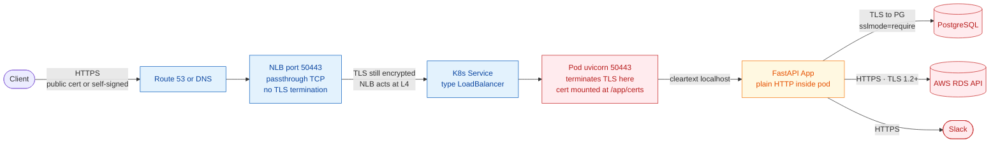

---

## Infrastructure

### AWS — Terraform Modules (`provisioning/terraform/aws/web_infra/`)

| Module | Purpose |
|---|---|
| `vpc` | VPC + public & private subnets across AZs (us-west-2) |
| `nat_gateway` | NAT GW for private subnet internet egress |
| `security_groups` | ALB and app-tier security groups |
| `alb` | Application Load Balancer (HTTPS listener, target groups) |
| `acm` | TLS certificate via AWS Certificate Manager |
| `ec2/app` | Application EC2 instances in private subnet |
| `ec2/bastion` | Bastion host in public subnet for SSH tunneling |
| `route_tables` | Route table associations for public/private subnets |
| `subnets` | Subnet CIDR definitions |
| `vpc-endpoint-s3` | S3 VPC endpoint for private subnet connectivity |

### AWS Container Deployments

- **ECR** — Private container registry for Docker images.
- **ECS** — Fargate task definitions + IAM execution roles.
- **EKS** — Managed Kubernetes; cluster creation/teardown via bash scripts in `aws/eks/`.

### GCP — GKE (`gcp/gke/`)

- Kubernetes manifests for Admin (3 replicas) and User (configurable) deployments.
- `flaskapp1.yaml` — combined manifest.
- LoadBalancer services expose apps externally.

### Kubernetes Operators (`kubernetes/operators/`)

| Operator | Purpose |
|---|---|
| Prometheus | Metrics collection |
| Grafana | Metrics dashboards |
| RabbitMQ | Message queue (for async RDS operations) |

### ArgoCD GitOps (`argocd/`) — sole applier of cluster state

- [`helm/argocd.sh`](argocd/helm/argocd.sh) installs real ArgoCD via the official `argo/argo-cd` chart (this previously installed the unrelated Argo Workflows chart despite the directory name — fixed).
- [`apps/`](argocd/apps/) — one `Application` CR per app × cloud (6 total), each pointing at a Kustomize base under `azure/aks/deploy/manifest/`, `aws/eks/deploy/manifest/`, or `gcp/gke/deploy/manifests/`, with `syncPolicy.automated` (prune + selfHeal).
- CI's `deploy` job no longer runs `kubectl apply` — it calls the ArgoCD API (`argocd app set --kustomize-image` → `sync` → `wait`) and ArgoCD does the actual reconciliation. See [ArgoCD GitOps setup](docs/github-secrets.md#argocd-gitops-setup--sole-applier) for one-time setup and the `CHANGEME` placeholders each Kustomize base needs filled in.

### Secrets Store CSI Driver — replacing the plaintext K8s Secret

Every `fastapi1/` and `fastapi-admin/` manifest directory (all 3 clouds) now ships a `secretproviderclass.yaml` that syncs DB credentials + the JWT signing key from AWS Secrets Manager / Azure Key Vault / GCP Secret Manager into the same `fastapi-db-secret` K8s Secret the app already reads — no application code change. The old plaintext `secret.yaml` is marked deprecated and no longer applied by CI. See [Secrets Store CSI Driver](docs/github-secrets.md#secrets-store-csi-driver-replacing-the-plaintext-k8s-secret) for the cluster-side prerequisites (driver install + IAM bindings) this can't provision from a repo edit alone.

### NetworkPolicy + pod hardening baseline

Every `fastapi1/` and `fastapi-admin/` deployment now ships a `networkpolicy.yaml` (ingress limited to the app port; egress limited to DNS/HTTPS/Postgres — previously zero policies protected these workloads) and the main container runs with `readOnlyRootFilesystem: true` across all three clouds (EKS previously disabled this with a `# uvicorn writes temp files` comment; an `emptyDir` mounted at `/tmp` — also used for the app's log file, see `startup.sh` — makes the read-only root filesystem actually work instead of being switched off).

---

## CI/CD Pipeline

Six workflows live under [`.github/workflows/`](.github/workflows/) — one per (app × cloud) combination plus a standalone Trivy scan. Each pipeline is a 10-stage DevSecOps flow: secret-scan → SAST → SCA → build → container-scan → IaC-scan → sign-and-sbom → deploy → DAST → notify.

> **Every scan gate now blocks the build.** Bandit/Semgrep/pip-audit/Trivy/Checkov/ZAP
> used to run with `|| true` / `exit-code: "0"` / `soft_fail: true` / `fail_action: false`
> — visibility without enforcement. All six now fail the pipeline on High/Critical findings.

### DevSecOps Pipeline — 10-Stage Flow

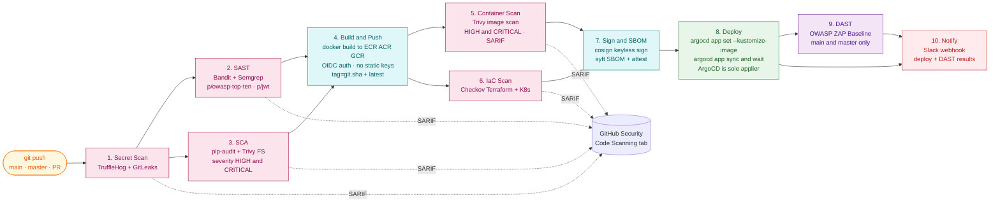

### Pipeline Stage Dependency Graph

Showing job-level `needs:` dependencies (concurrency in green, gates in red).

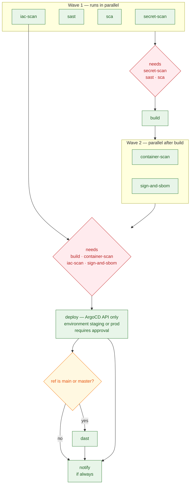

### GitOps Reconciliation Loop (ArgoCD)

ArgoCD is the **sole applier** of cluster state — CI never runs `kubectl apply`.
The pipeline builds and pushes the image, then calls the ArgoCD API to point
each `Application` (see [`argocd/apps/`](argocd/apps/)) at the new tag and
trigger a sync; ArgoCD (in-cluster, its own service account) does the actual
reconciliation, and keeps polling Git independently of CI. See
[`argocd/helm/argocd.sh`](argocd/helm/argocd.sh) and
[ArgoCD GitOps setup](docs/github-secrets.md#argocd-gitops-setup--sole-applier).

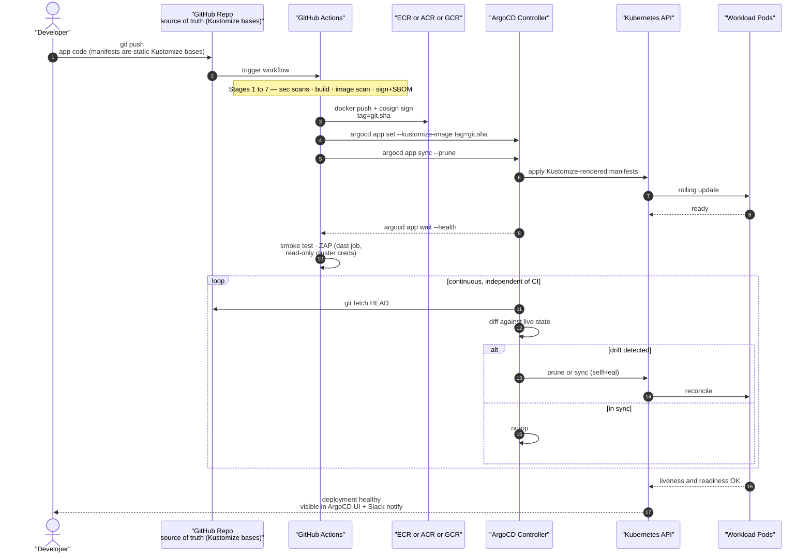

### Security Scanning Coverage Matrix

Each tool maps to specific OWASP Top 10 categories and pipeline stages.

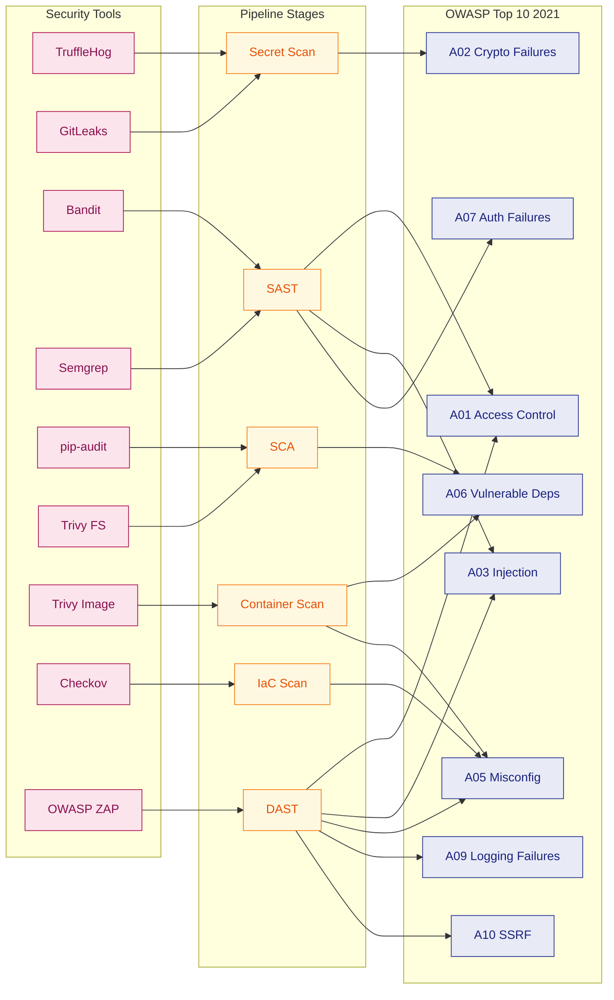

### Workflow Files

| Workflow | App | Target Cloud | Image Registry |
|---|---|---|---|
| [`devsecops-fastapi-user-eks.yml`](.github/workflows/devsecops-fastapi-user-eks.yml)   | USER  | AWS EKS   | ECR |
| [`devsecops-fastapi-admin-eks.yml`](.github/workflows/devsecops-fastapi-admin-eks.yml) | ADMIN | AWS EKS   | ECR |
| [`devsecops-fastapi-user-gke.yml`](.github/workflows/devsecops-fastapi-user-gke.yml)   | USER  | GCP GKE   | Artifact Registry |
| [`devsecops-fastapi-admin-gke.yml`](.github/workflows/devsecops-fastapi-admin-gke.yml) | ADMIN | GCP GKE   | Artifact Registry |
| [`devsecops-fastapi-user-aks.yml`](.github/workflows/devsecops-fastapi-user-aks.yml)   | USER  | Azure AKS | Azure ACR |
| [`devsecops-fastapi-admin-aks.yml`](.github/workflows/devsecops-fastapi-admin-aks.yml) | ADMIN | Azure AKS | Azure ACR |
| [`trivy-scan.yaml`](.github/workflows/trivy-scan.yaml) | (standalone) | — | — |

---

## Getting Started

### Prerequisites

- Docker & Docker Compose
- Python 3.9+
- AWS credentials configured (`~/.aws/credentials` or environment variables)
- PostgreSQL (or use the included DB container)

### Run with Docker

```bash
# Build and start all services (USER app, ADMIN app, PostgreSQL)
cd dockerized

# USER app (HTTPS on port 50443)
docker build -t fastapi-user ./USER
docker run -p 50443:50443 --env-file USER/env.sh fastapi-user

# ADMIN app (HTTPS on port 30443)
docker build -t flask-admin ./ADMIN
docker run -p 30443:30443 --env-file ADMIN/env.sh flask-admin
```

### Environment Variables

Both apps expect these variables (see `env.sh` in each app directory):

```bash
DB_HOST=<postgres-host>
DB_PORT=5432
DB_NAME=flaskapp
DB_USER=<db-user>
DB_PASSWORD=<db-password>
AWS_DEFAULT_REGION=us-east-1
AWS_ACCESS_KEY_ID=<key>
AWS_SECRET_ACCESS_KEY=<secret>
SECRET_KEY=<jwt-secret>
```

USER_FASTAPI additionally needs these to enable `/agent/restore-workflow` (see [`docs/github-secrets.md`](docs/github-secrets.md)):

```bash
ANTHROPIC_API_KEY=<claude-api-key>
ANTHROPIC_MODEL=claude-sonnet-5  # optional, defaults to claude-sonnet-5
```

### Initialize the Database

```bash
psql -h <host> -U <user> -d flaskapp -f dockerized/DB/schema/flaskapp.sql
```

---

## Usage — cURL Examples

### Restore a DB from Snapshot

```bash
#!/bin/bash
# Restore RDS instance from snapshot

snapshotname=${1}   # e.g. my-snapshot-name
endpoint=${2}       # e.g. myDB.cluster-XXXYYY.us-east-1.rds.amazonaws.com

EMAIL=$(cat ~/.password/mySecrets2 | grep email | awk '{print $2}')
PASSWORD=$(cat ~/.password/mySecrets2 | grep password | awk '{print $2}')

# Login (stores JWT cookie)
curl -k "https://192.168.2.15:50443/login" \
    --data-urlencode "email=${EMAIL}" \
    --data-urlencode "password=${PASSWORD}" \
    --cookie-jar cookies.txt --verbose > login_log.html

# Trigger restore
curl -k "https://192.168.2.15:50443/restore" \
    --data-urlencode "snapshotname=${snapshotname}" \
    --data-urlencode "endpoint=${endpoint}" \
    --cookie cookies.txt --cookie-jar cookies.txt --verbose
    echo

rm -f cookies.txt
```

### Check Restore Status

```bash
#!/bin/bash
snapshotname=${1}
endpoint=${2}

EMAIL=$(cat ~/.password/mySecrets2 | grep email | awk '{print $2}')
PASSWORD=$(cat ~/.password/mySecrets2 | grep password | awk '{print $2}')

curl -k "https://192.168.2.15:50443/login" \
    --data-urlencode "email=${EMAIL}" \
    --data-urlencode "password=${PASSWORD}" \
    --cookie-jar cookies.txt --verbose > login_log.html

curl -k "https://192.168.2.15:50443/status" \
    --data-urlencode "snapshotname=${snapshotname}" \
    --data-urlencode "endpoint=${endpoint}" \
    --cookie cookies.txt --cookie-jar cookies.txt --verbose
    echo

rm -f cookies.txt
```

### Attach DB Instance to Cluster

```bash
#!/bin/bash
endpoint=${1}       # e.g. myDB.cluster-XXXYYY.us-east-1.rds.amazonaws.com
instanceclass=${2}  # e.g. db.t3.medium

EMAIL=$(cat ~/.password/mySecrets2 | grep email | awk '{print $2}')
PASSWORD=$(cat ~/.password/mySecrets2 | grep password | awk '{print $2}')

curl -k "https://192.168.2.15:50443/login" \
    --data-urlencode "email=${EMAIL}" \
    --data-urlencode "password=${PASSWORD}" \
    --cookie-jar cookies.txt --verbose > login_log.html

curl -k "https://192.168.2.15:50443/attachdb" \
    --data-urlencode "endpoint=${endpoint}" \
    --data-urlencode "instanceclass=${instanceclass}" \
    --cookie cookies.txt --cookie-jar cookies.txt --verbose
    echo

rm -f cookies.txt
```

### Run the Agentic Restore Workflow

```bash
#!/bin/bash
# Restore + status + optional attach + notify, planned and executed by the
# LangGraph agent in a single call. Requires ANTHROPIC_API_KEY to be set on
# the running USER_FASTAPI container.

snapshotname=${1}    # e.g. my-snapshot-name
endpoint=${2}        # e.g. myDB.cluster-XXXYYY.us-east-1.rds.amazonaws.com
instanceclass=${3}   # optional — attach a reader once restored, e.g. db.r5.large

EMAIL=$(cat ~/.password/mySecrets2 | grep email | awk '{print $2}')
PASSWORD=$(cat ~/.password/mySecrets2 | grep password | awk '{print $2}')

curl -k "https://192.168.2.15:50443/login" \
    --data-urlencode "email=${EMAIL}" \
    --data-urlencode "password=${PASSWORD}" \
    --cookie-jar cookies.txt --verbose > login_log.html

curl -k "https://192.168.2.15:50443/agent/restore-workflow" \
    --data-urlencode "snapshotname=${snapshotname}" \
    --data-urlencode "endpoint=${endpoint}" \
    --data-urlencode "instanceclass=${instanceclass}" \
    --data-urlencode "goal=Restore this snapshot and attach a reader once it's ready." \
    --cookie cookies.txt --cookie-jar cookies.txt --verbose
    echo

rm -f cookies.txt
```

---

## Screenshots

Sign Up page:

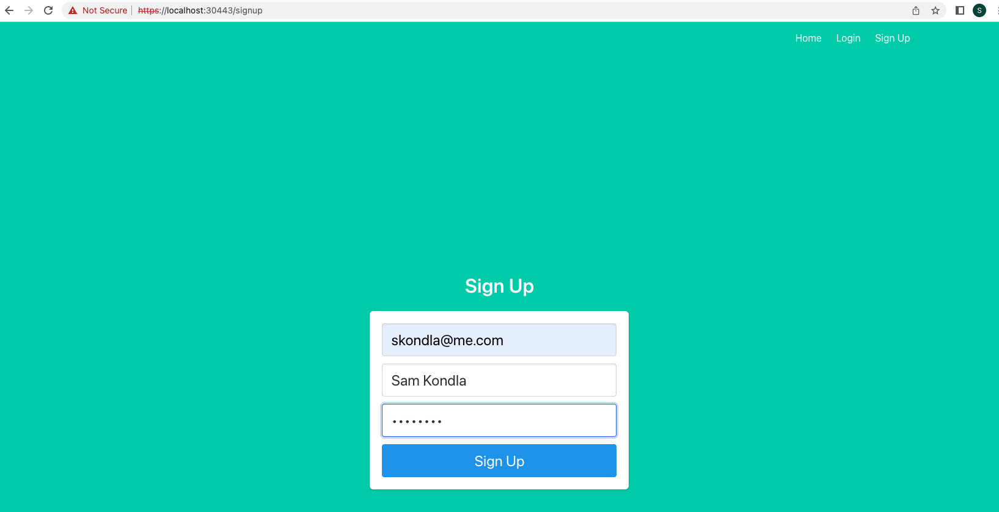

Sign In page:

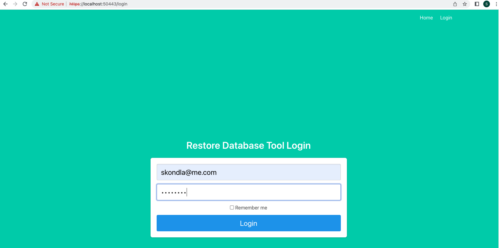

RestoreDB page:

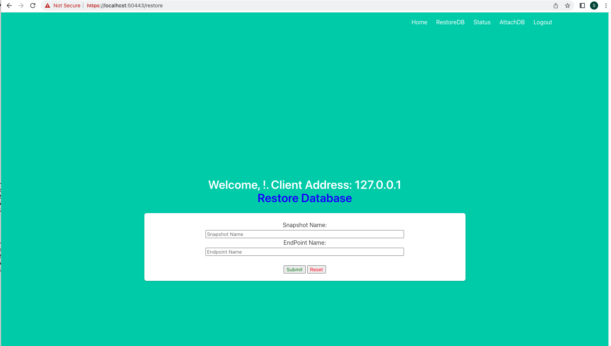

RestoreDB Status page:

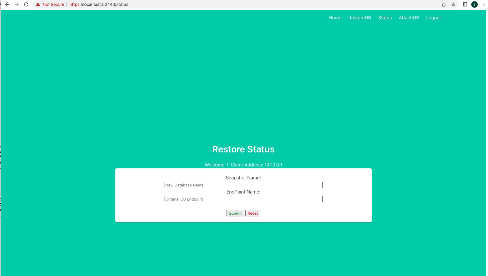

AttachDB page 1:

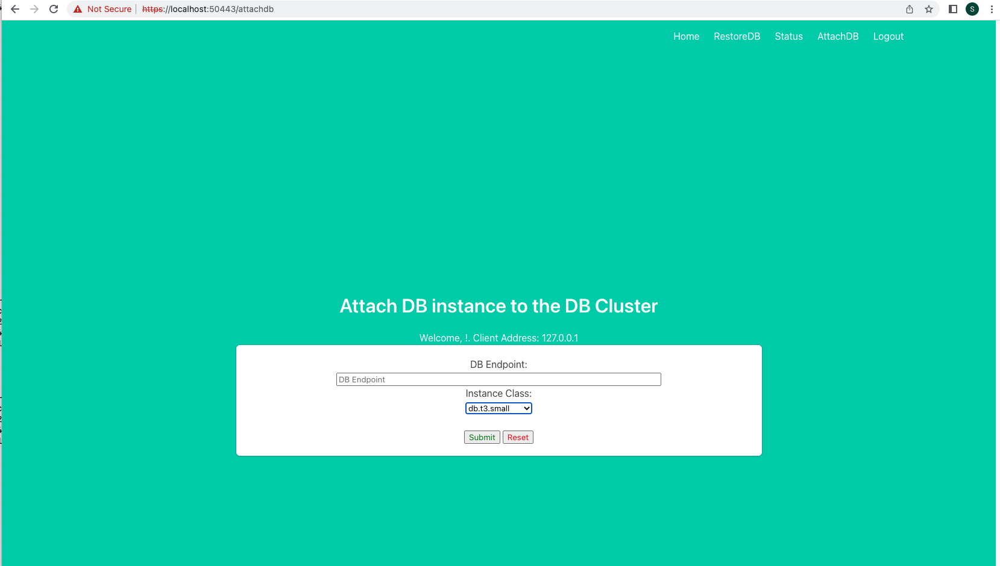

AttachDB page 2:

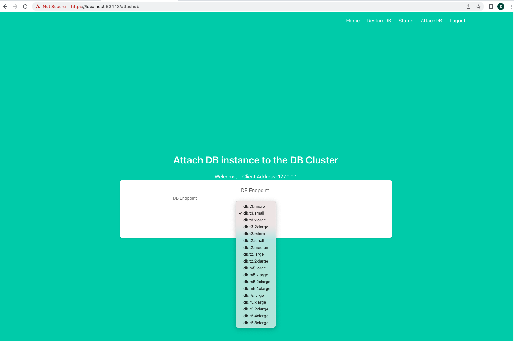

DB Restore Options after login:

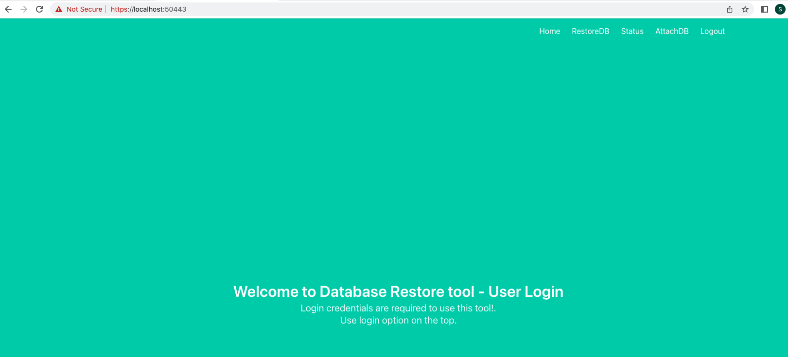

---

## Contact

###### skondla.ai@gmail.com

###### DevSecOps Blog Posts

[DevSecOps — Deploying WebApp on Azure AKS cluster with Github Actions](https://kondlawork.medium.com/devsecops-deploying-webapp-on-azure-aks-cluster-with-github-actions-efc72bdc552a)

[DevSecOps — Deploying WebApp on AWS EKS cluster with Github Actions](https://kondlawork.medium.com/devsecops-deploying-webapp-on-aws-eks-cluster-with-github-actions-da8865a1b27)

[DevSecOps — Deploying WebApp on Google Cloud GKE cluster with Github Actions](https://medium.com/@kondlawork/devsecops-deploying-webapp-on-google-cloud-gke-cluster-with-github-actions-1028c0630dde)
